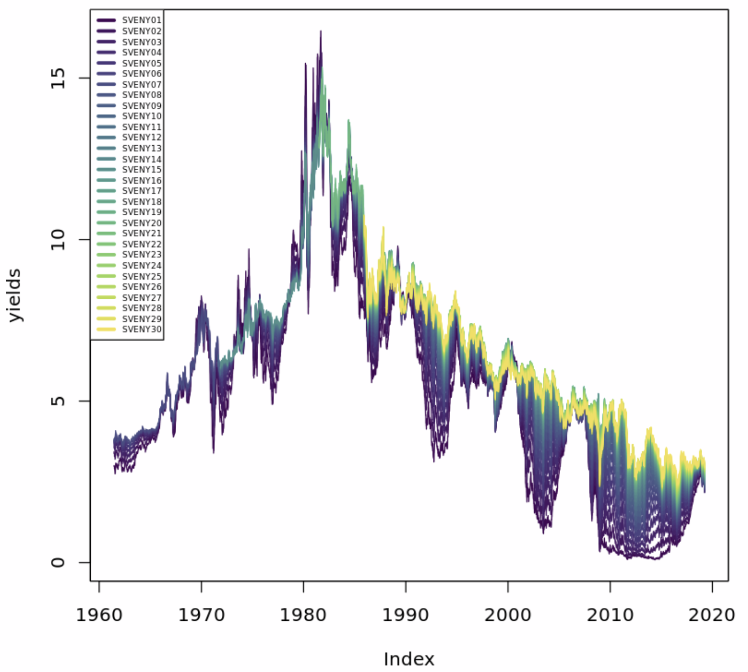
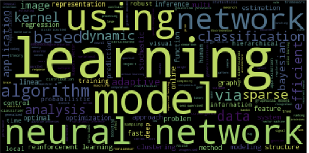

# Other Projects - Data Analysis Portfolio

Welcome to my GitHub repository, where I showcase my skills and projects in data analysis, with a special focus on financial data analytics. Below you'll find highlights of my technical skills and selected projects demonstrating my expertise.

  
  
  
  
  

  

## Technical Skills

- **SQL Databases:**
  - **MySQL:** Proficient in writing complex queries, optimizing performance, and database design.
  - **Snowflake:** Experienced in utilizing Snowflake's unique features for large-scale data analytics.

- **Programming Languages:**
  - **R:** Advanced data analysis, visualization, and statistical modeling.
  - **Python:** Data manipulation, machine learning, and automation with Python.

## Selected Projects

Here are some of the projects I've worked on that demonstrate my ability to analyze financial and other complex data sets.

  

- [Modeling the Volatility of US Bond Yields with R](https://github.com/dsrichard97/otherprojects/blob/main/modelwith_usbond.pdf)
  - In this project, we will delve into the volatility patterns present in U.S. Government Bond Yields, a concept known as volatility clustering, where periods of low and high volatility tend to succeed each other. These patterns are crucial for risk management and making informed investment decisions. We'll be utilizing the GARCH (Generalized AutoRegressive Conditional Heteroskedasticity) model to analyze the statistical characteristics of the financial time series data. The project is designed for those with an understanding of time series analysis and GARCH models, as well as proficiency in using the xts and rugarch packages for analysis and visualization. The bond yield data we'll be working with is sourced from the US Federal Reserve Data Releases, accessible through Quandl.

  

- [Hot Topics in Machine Leanring with Python](https://github.com/dsrichard97/otherprojects/blob/main/Hottest%20Topics%20in%20ML.pdf)
  - In this project, I conducted an in-depth analysis of research papers from the Neural Information Processing Systems (NIPS) conference—one of the most prestigious machine learning forums globally—to identify current trends in the field. The project involved handling and examining a substantial text dataset using Python and pandas, along with applying Natural Language Processing techniques via the sklearn library in Python. This analysis not only sheds light on the direction in which machine learning research is heading but also demonstrates the applicability of these data processing methods to other large text-based datasets.

  

- [Analyze International Debt Statistics with SQL](https://github.com/dsrichard97/otherprojects/blob/main/worldbank%20international%20debt.pdf)
  - This project involves the analysis of international debt data gathered by The World Bank. The aim is to scrutinize the financial amounts (in USD) that developing countries owe under various categories. Key objectives of this analysis include:

1. Determining the total sum of debt owed by the nations included in the dataset.
2. Identifying the country with the largest debt and quantifying this debt.
3. Calculating the average debt owed by these countries across different indicators of debt.
   
The dataset in question spans from 1970 to 2015 and encompasses both national and regional debt figures for a multitude of countries worldwide. This analysis is not only critical for understanding the scale of debt that developing countries face but also for identifying patterns and outliers in international debt statistics.

  

- [Golden Age of Video Games? with MySQL](https://github.com/dsrichard97/otherprojects/blob/main/tenbestselling.pdf)
  - In this analytical project, I examined a comprehensive dataset of the top 400 video games from 1977 onwards, focusing on user and critic scores, as well as sales data. The goal was to identify a period that could be considered the 'golden age' of video games, marked by both critical acclaim and commercial success.

Key tasks included:

1. Ranking the ten highest-grossing video games.
2. Investigating any gaps in review scores.
3. Identifying the years that received the highest ratings from critics.
4. Assessing the validity of 1982 as a standout year in gaming.
5. Determining which years saw a decline in critical acclaim.
6. Discovering the years most favored by gamers.
7. Analyzing the overlap between critic and user preferences.
8. Evaluating sales data for the most successful years in gaming.
   
This project showcases my ability to manipulate and analyze complex data sets, derive meaningful insights, and understand trends in the gaming industry. It also highlights my proficiency in essential data analysis techniques such as dataset joining, set theory, and data filtering/grouping.

  

- [Exploring London's Travel Network with Snowflake](https://app.datacamp.com/workspace/w/42897788-52cb-46ee-8554-a67074c99db2/edit)
  - In this project, I analyzed a dataset encompassing over a decade of public transport usage in London to understand travel patterns within the city. Utilizing databases like Snowflake, Amazon Redshift, or Google BigQuery, I executed SQL queries to identify the most frequently used modes of transportation, pinpoint times of high activity for the Emirates Airline cable car, and spot uncommon instances of low traffic on the Underground. This investigation provides insights into the dynamics of London's transport network and traveler behavior from 2010 to 2022.

Feel free to browse through my repositories and explore the various projects and skills I've developed.

